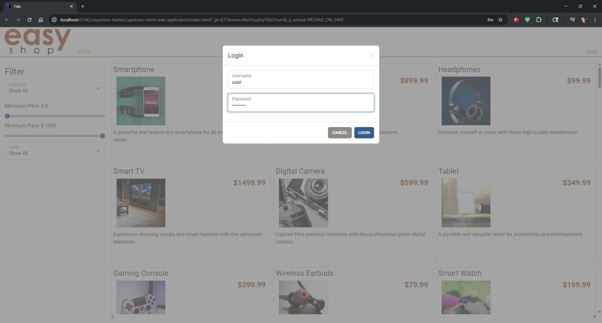
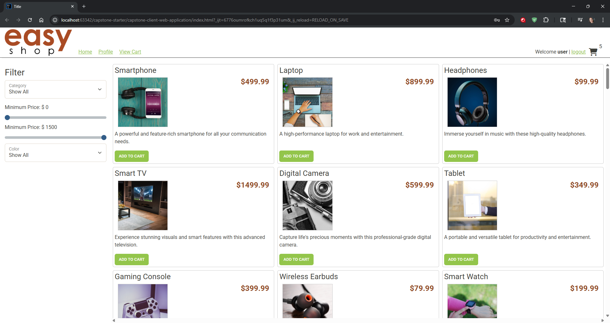
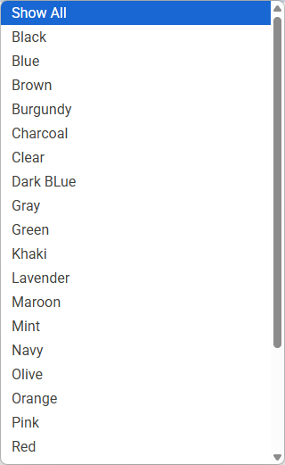
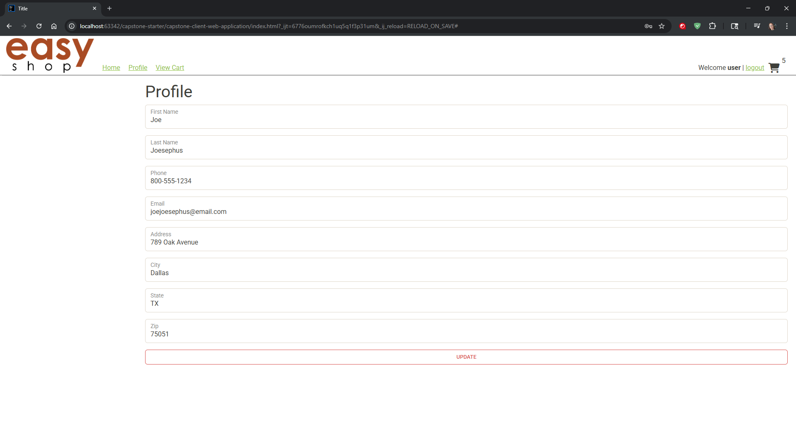
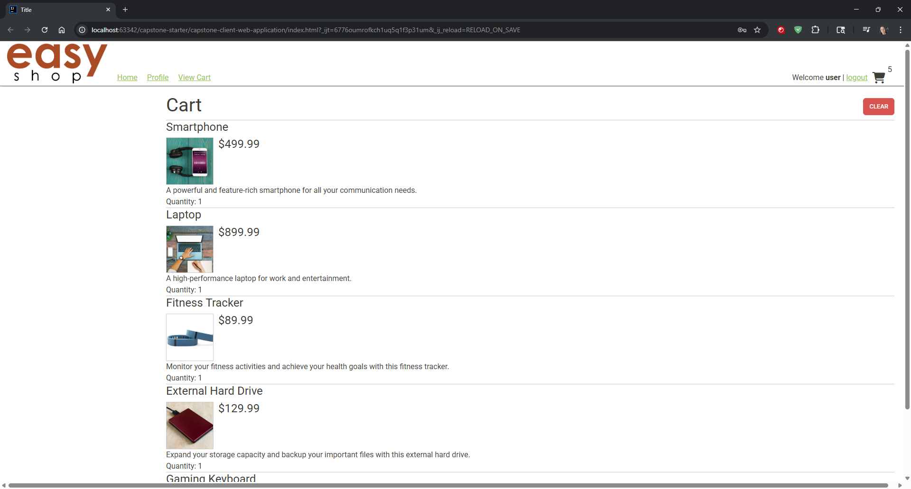

# Capstone 3


---

# EasyShop E-Commerce API

## Overview

This project is the backend for **EasyShop**, an e-commerce application built with Java and Spring Boot. It provides a RESTful API to manage users, products, categories, shopping carts, and order processing. This is a continuation of the EasyShop Version 1 project, with additional features and bug fixes developed for the final capstone.

## Technologies Used

* Java 17
* Spring Boot
* Spring Web
* Spring Security (JWT-based authentication)
* MySQL
* Maven
* Postman (for API testing)

## Getting Started

### Prerequisites

* JDK 17+
* MySQL Server
* IntelliJ IDEA Community Edition
* Web Browser

### Setup

1. **Clone the Repository**

   ```bash
   git clone https://github.com/MayaAThompson/capstone-3.git
   ```

2. **Database Setup**

    * Open MySQL Workbench.
    * Run the provided `create_database.sql` script from the `database` folder to create and populate the `easyshop` database.

3. **Configure `application.properties`**

   Update the file `src/main/resources/application.properties` with your MySQL credentials:

   ```properties
   datasource.url=jdbc:mysql://localhost:3306/easyshop
   datasource.username=yourUsername
   datasource.password=yourPassword
   ```

4. **Run the Application**

   In IntelliJ IDEA:

    * Open the project.
    * Run the `EasyshopApplication` class.


## API Endpoints

Authentication:

* `POST /register`
* `POST /login`

Products:

* `GET /products`
* `GET /products/{id}`
* `POST /products` *(Admin only)*
* `PUT /products/{id}` *(Admin only)*
* `DELETE /products/{id}` *(Admin only)*

Categories:

* `GET /categories`
* `POST /categories` *(Admin only)*
* `PUT /categories/{id}` *(Admin only)*
* `DELETE /categories/{id}` *(Admin only)*

Shopping Cart:

* `GET /cart`
* `POST /cart/products/{productId}`
* `PUT /cart/products/{productId}`
* `DELETE /cart`

Profile:

* `GET /profile`
* `PUT /profile`

## Testing

Use the provided Postman collections:

* `easyshop.postman_collection.json`
* `easyshop-optional.postman_collection.json`  
note: Tests are based on the default state of the db. You will need to do a fresh import of the db for the tests to work properly.

Import these into Postman to test all available endpoints.

## Notes

* JWT tokens are required for accessing protected endpoints. Login first to obtain a token and include it in the `Authorization` header.
* Bugs from the initial version have been identified and resolved.
* Additional features are included per the Capstone project requirements.

## Application Screens

  
  
  
  
  
  

## Example Code

```java
@Override
    public void update(int productId, Product product)
    {
        String sql = """
                UPDATE products
                SET name = CASE
                	WHEN ? != '' THEN ?
                    ELSE name
                END,
                price = CASE
                	WHEN ? != '' THEN ?
                    ELSE price
                END,
                category_id = CASE
                	WHEN ? != '' THEN ?
                    ELSE category_id
                END,
                description = CASE
                	WHEN ? != '' THEN ?
                    ELSE description
                END,
                color = CASE
                	WHEN ? != '' THEN ?
                    ELSE color
                END,
                image_url = CASE
                	WHEN ? != '' THEN ?
                    ELSE image_url
                END,
                stock = CASE
                	WHEN ? != '' THEN ?
                    ELSE stock
                END,
                featured = CASE
                	WHEN ? != '' THEN ?
                    ELSE featured
                END
                WHERE product_id = ?;""";

        try (Connection connection = getConnection())
        {
            PreparedStatement statement = connection.prepareStatement(sql);
            statement.setString(1, product.getName());
            statement.setString(2, product.getName());
            statement.setBigDecimal(3, product.getPrice());
            statement.setBigDecimal(4, product.getPrice());
            statement.setInt(5, product.getCategoryId());
            statement.setInt(6, product.getCategoryId());
            statement.setString(7, product.getDescription());
            statement.setString(8, product.getDescription());
            statement.setString(9, product.getColor());
            statement.setString(10, product.getColor());
            statement.setString(11, product.getImageUrl());
            statement.setString(12, product.getImageUrl());
            statement.setInt(13, product.getStock());
            statement.setInt(14, product.getStock());
            statement.setBoolean(15, product.isFeatured());
            statement.setBoolean(16, product.isFeatured());
            statement.setInt(17, productId);

            statement.executeUpdate();
        }
        catch (SQLException e)
        {
            throw new RuntimeException(e);
        }
    }
```

This method saw a few different iterations over the course of the project. This is something that was included working in the starter code, however I found during testing that if you sent a 'PUT' request without filling every field it would discard the information in the fields not filled out. I changed the MySQL UPDATE to only change a field if it has information in it, otherwise it keeps the previous info.  

Example: in Postman with these changes you can send a PUT request to http://localhost:8080/products/1  
body: 
```json
{
    "color": "green"
}
```
and it will  update the color of the product in the database without having to do the extra work of typing in the whole product json, only the fields you need to change.  
This was also implemented in the Profiles section in the same way.

---

